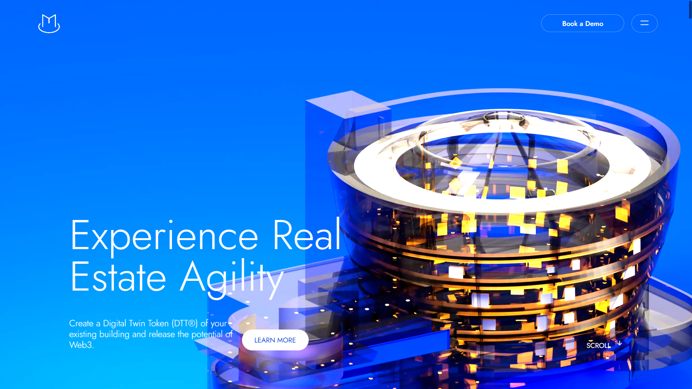

# Magma Website Clone

This project is a replica of the Magma website, demonstrating proficiency in modern web development practices. It features a responsive design, smooth scrolling animations, and interactive elements that closely mimic the original site's functionality and aesthetics.

## Features

- Responsive design for various screen sizes
- Smooth scrolling animations using Locomotive Scroll
- GSAP animations for text fading and image sequences
- Interactive buttons with hover effects
- Animated circular progress indicator
- Image marquee effect
- Social media links with hover animations

## Key Animations
- Text fade-in effects
- Image sequence animations for visual storytelling
- Circular progress indicator
- Smooth scrolling and parallax effects

## License

This project is created for educational purposes only. All rights for the original design belong to Magma.